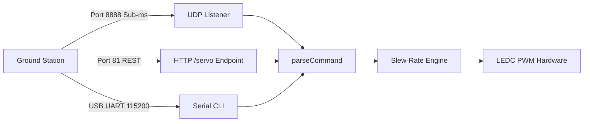

# Chapter 2: Embedded Systems & Firmware Engineering

The embedded tier of Agesis EYE transforms an ultra-low-cost, resource-constrained **ESP32-CAM** development board into an autonomous dual-axis vision and targeting node.

This chapter details the bare-metal microcontroller configuration, peripheral pin allocation, high-precision PWM timing calculations, power budgeting, and communication engines implemented in [esp32_cam_stream.ino](file:///c:/Users/ASUS/Desktop/Agesis%20EYE/firmware/esp32_cam_stream/esp32_cam_stream.ino).

---

## 1. Hardware Platform: ESP32-CAM (AI-Thinker)

The AI-Thinker ESP32-CAM integrates an **ESP32-D0WDQ6-V3** SoC with an external **4MB PSRAM** chip and an OV2640 camera connector.

```
       +---------------------------------------------+
       |             AI-THINKER ESP32-CAM            |
       |                                             |
       |  [ OV2640 Camera ]        [ Flash LED IO4 ] |
       |                                             |
       |  IO12  [ Pan PWM (LEDC CH2) ]               |
       |  IO13  [ Tilt PWM (LEDC CH3) ]              |
       |  IO14  [ Laser Diode Trigger ]              |
       |                                             |
       |  5V    [ 5V 2A Adapter Input ]              |
       |  GND   [ Common Ground ]                    |
       |  U0TXD [ Serial Debug 115200 ]              |
       |  U0RXD [ Serial Command In ]                |
       +---------------------------------------------+
```

### Critical GPIO Allocation Constraints
Selecting GPIO pins on the ESP32-CAM is notoriously difficult because nearly all pins are routed internally to the camera sensor bus or flash memory:

| GPIO | Internal Assignment | Turret Usage | Why Selected / Precautions |
| :--- | :--- | :--- | :--- |
| **GPIO 12** | HSPI MISO / SD Card Data 2 | **Pan Servo PWM** | Free when SD card is disabled. Can output clean LEDC PWM. |
| **GPIO 13** | HSPI MOSI / SD Card Data 3 | **Tilt Servo PWM** | Free when SD card is disabled. Dedicated to elevation servo. |
| **GPIO 14** | HSPI CLK / SD Card CLK | **Laser Diode Trigger** | Digital output to MOSFET or direct laser cathode driver. |
| **GPIO 4** | Built-in Flash LED | Status Indication | Kept LOW during tracking to prevent sensor oversaturation. |
| **GPIO 16** | **PSRAM Chip Select** | **DO NOT USE** | Reserved for external PSRAM. Toggling this pin crashes the system! |
| **GPIO 0** | Camera XCLK / Boot Mode | Reserved | Strapping pin. Toggling during boot forces flash download mode. |

---

## 2. SG90 Micro-Servo PWM Generation (LEDC Driver)

Standard RC hobby servos require a $50\text{ Hz}$ PWM signal (a $20\text{ ms}$ repetition period) where the pulse width dictates the shaft angle:
* **$1.0\text{ ms}$ ($1000\,\mu\text{s}$)**: $0^\circ$ (Minimum limit)
* **$1.5\text{ ms}$ ($1500\,\mu\text{s}$)**: $90^\circ$ (Neutral center)
* **$2.0\text{ ms}$ ($2000\,\mu\text{s}$)**: $180^\circ$ (Maximum limit)

*(Note: TowerPro SG90 servos typically support an extended travel range from $544\,\mu\text{s}$ to $2400\,\mu\text{s}$).*

### Timer Math & Duty Cycle Resolution
Rather than relying on blocking delay loops, the firmware configures the ESP32’s native **LEDC (LED Control) hardware PWM generator**:

1. **Timer Configuration**:
   * PWM Frequency $f_{\text{pwm}} = 50\text{ Hz}$
   * Period $T = \frac{1}{50\text{ Hz}} = 0.02\text{ s} = 20,000\,\mu\text{s}$
   * Timer Resolution = $14\text{-bit}$ ($2^{14} = 16,384$ discrete counts)
2. **Duty Cycle Formula**:
   $$\text{Duty Ticks} = \left(\frac{\text{Pulse Width } (\mu\text{s})}{20,000\,\mu\text{s}}\right) \times 16,383$$
3. **Pulse Width Mapping**:
   $$\text{Pulse Width}(\theta) = 544\,\mu\text{s} + \left(\frac{\theta}{180^\circ}\right) \times (2400\,\mu\text{s} - 544\,\mu\text{s})$$

```cpp
uint32_t angleToDuty(float angle) {
    angle = constrain(angle, 0.0f, 180.0f);
    float us = SERVO_MIN_US + (angle / 180.0f) * (SERVO_MAX_US - SERVO_MIN_US);
    return (uint32_t)((us / 20000.0f) * 16383.0f);
}
```

This yields a resolution of $\approx 0.013^\circ$ per tick, ensuring smooth movement without visible stepping.

### Continuous 360° Servo Mode
For continuous-rotation SG90 servos, the pulse width dictates angular velocity and direction rather than position:
* $1500\,\mu\text{s}$: Stop ($0\text{ RPM}$)
* $<1500\,\mu\text{s}$: Clockwise rotation (speed proportional to $|1500 - \mu\text{s}|$)
* $>1500\,\mu\text{s}$: Counter-clockwise rotation

The firmware provides a single compile-time toggle `#define SERVO_360_PAN_MODE true` to adapt between standard and continuous variants.

---

## 3. Power Budgeting & Inrush Slew-Rate Limiting

### The 5V 2A Shared Power Supply Problem
Both the ESP32 and the two SG90 servos draw power from a single 5V 2A wall adapter:
* **ESP32 Wi-Fi Radio**: Consumes $\approx 180\text{ mA}$ continuous, spiking to $350\text{--}400\text{ mA}$ during RF transmissions.
* **SG90 Micro-Servos**: Consume $\approx 150\text{ mA}$ during steady rotation, but **stall/inrush current spikes to $650\text{--}800\text{ mA}$ per servo** when accelerating instantaneously from rest.

$$\text{Worst-Case Peak} = 400\text{ mA} + 800\text{ mA} + 800\text{ mA} = 2,000\text{ mA} \quad (2.0\text{ A})$$

If both servos step abruptly, the 5V rail sags below $4.4\text{ V}$. This triggers the ESP32's internal brownout detector, causing continuous reset loops.

### The Two-Fold Solution

#### 1. Hardware Slew-Rate Limiting (Soft Acceleration)
Instead of slamming the PWM duty cycle to the target angle in a single step, the firmware runs a $50\text{ Hz}$ smoothing filter:

```cpp
if (now - lastServoUpdateMs >= 20) {
    lastServoUpdateMs = now;
    
    // Pan axis smooth slew (Max 2.4 degrees per 20ms = 120 deg/sec)
    float dPan = targetPanAngle - currentPanAngle;
    if (abs(dPan) > MAX_SLEW_STEP_DEG) {
        currentPanAngle += (dPan > 0) ? MAX_SLEW_STEP_DEG : -MAX_SLEW_STEP_DEG;
    } else {
        currentPanAngle = targetPanAngle;
    }
    
    applyServoDuty();
}
```

By capping angular acceleration, the motor never operates in the dead-stall regime, keeping peak currents below $350\text{ mA}$ per servo and protecting the 5V rail.

#### 2. Bare-Metal Brownout Override
At the very beginning of `setup()`, the brownout detector is disabled to tolerate transient voltage dips:

```cpp
#include "soc/soc.h"
#include "soc/rtc_cntl_reg.h"

void setup() {
    WRITE_PERI_REG(RTC_CNTL_BROWN_OUT_REG, 0); // Disable brownout reset
    ...
}
```

---

## 4. Multi-Protocol Command Interface

To guarantee flexibility and reliability, the firmware implements three concurrent command listeners:



1. **High-Speed UDP Listener (Port 8888)**:
   * Non-blocking socket listener via `WiFiUDP`.
   * Directly parses ASCII strings formatted as `P:<pan>,T:<tilt>,L:<laser>`.
   * Transit time is $<0.5\text{ ms}$, bypassing HTTP handshake and TCP congestion back-off.
2. **REST Endpoint (Port 81)**:
   * Accessible via `GET /servo?pan=90&tilt=90&laser=1`.
   * Returns a JSON confirmation status payload. Useful for browser debugging.
3. **Serial Terminal (UART0 @ 115200 baud)**:
   * Accepts commands directly over USB (`P90 T90 L0\n`).
