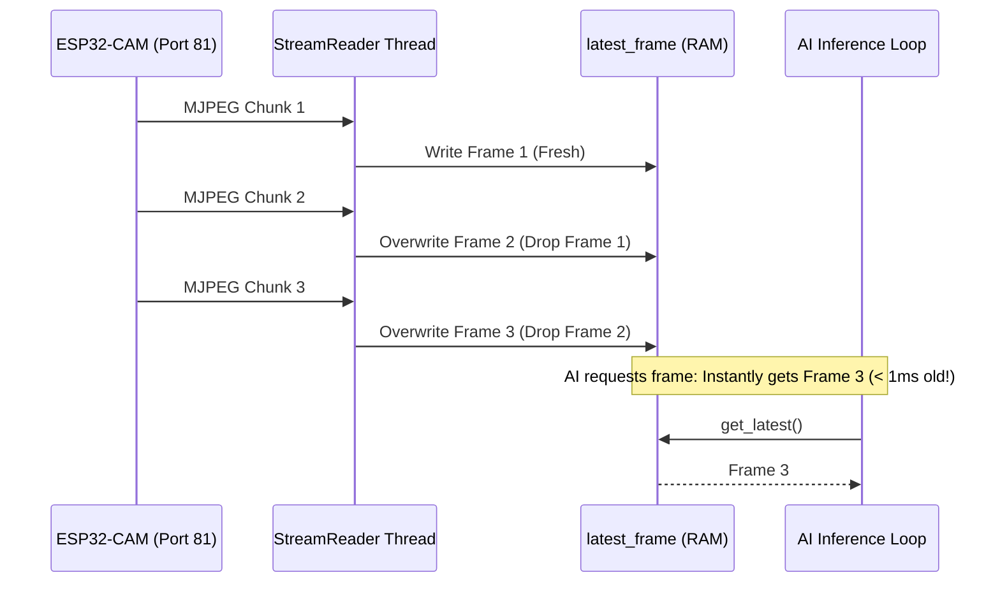

# Chapter 3: Edge AI & Real-Time Computer Vision Pipeline

The perception engine of Agesis EYE is an optimized, edge-capable computer vision system capable of tracking high-speed airborne targets with sub-$15\text{ ms}$ inference latencies.

This chapter details the decoupled video acquisition architecture, image preprocessing algorithms, ONNX model execution, and target state estimation implemented in [tracker.py](file:///c:/Users/ASUS/Desktop/Agesis%20EYE/backend/tracker.py).

---

## 1. Why Edge AI Matters for Autonomous Defense

Cloud-based vision processing suffers from round-trip network jitter ($150\text{--}500\text{ ms}$), bandwidth saturation, and connection dropouts. In physical robotics, a lag of even $100\text{ ms}$ causes control instability, overshoot, and lost target locks.

Agesis EYE performs **100% on-device local edge inference**:
* **Zero Cloud Dependency**: Runs entirely on the host ground station CPU/GPU.
* **Deterministic Timing**: Frame acquisition to servo output occurs in $<50\text{ ms}$.
* **Ultra-Low Bandwidth**: Raw video stays on the local subnet; only lightweight telemetry is transmitted across software components.

---

## 2. The Zero-Lag Video Acquisition Problem

When reading MJPEG network streams using standard library functions like OpenCV's `cv2.VideoCapture("http://...")`, internal operating system buffers automatically queue frames. If network transmission slows down momentarily, the socket fills with 5 to 10 stale frames.

As a result, OpenCV serves frames that were captured **200 to 500 ms in the past**. A tracking turret operating on stale frames will steer toward where the target *used to be*, causing violent oscillations.

### The `ZeroLagStreamReader` Architecture
To eliminate buffering latency, Agesis EYE uses a dedicated daemon worker that continuously consumes bytes from the HTTP socket and immediately overwrites a single memory reference:



```python
# Extract from tracker.py
while self.running:
    # Read chunk until JPEG end marker b'\xff\xd9'
    idx = buffer.find(b"\xff\xd9")
    if idx != -1:
        jpg_bytes = buffer[:idx+2]
        buffer = buffer[idx+2:]
        frame = cv2.imdecode(np.frombuffer(jpg_bytes, np.uint8), cv2.IMREAD_COLOR)
        if frame is not None:
            with self.lock:
                self.latest_frame = frame  # Atomically overwrite stale frame
```

This guarantees that whenever the AI pipeline finishes an inference cycle, the next frame it pulls is the freshest image available ($<2\text{ ms}$ latency).

---

## 3. ONNX Runtime Engine (High-Performance CPU Inference)

While native PyTorch (`.pt`) models are flexible for training, they carry heavy runtime overhead from dynamic Python execution and memory allocation.

For deployment, Agesis EYE executes **`agesis06.onnx`** via Microsoft's **ONNX Runtime (ORT)** engine:
1. **Operator Fusion**: Conv2D, Batch Normalization, and LeakyReLU layers are fused into single SIMD kernel calls.
2. **Multi-Threaded Execution**: Tuned with `torch.set_num_threads(4)` and native CPU thread pools to utilize AVX2/AVX-512 vector instructions.
3. **Throughput**: Achieves **45+ FPS** on standard consumer CPUs, eliminating the need for dedicated discrete GPUs.

---

## 4. Optical Preprocessing & Domain Transformation (EP-CLAHE)

In tactical outdoor environments, balloons and drones often face extreme backlight, lens flare, or heavy shadows.

To enhance detection sensitivity on low-contrast targets without increasing noise, the system includes an **Edge-Preserving Contrast Limited Adaptive Histogram Equalization (EP-CLAHE)** filter:

$$\text{CLAHE}(I) = \text{BilinearInterpolation}\left(\text{LocalHistEqualization}(I_{\text{tile}})\right)$$

```python
def apply_ep_clahe(img):
    # Convert BGR to Lab color space
    lab = cv2.cvtColor(img, cv2.COLOR_BGR2LAB)
    l, a, b = cv2.split(lab)
    
    # Apply CLAHE to L-channel only (preserves chromaticity)
    clahe = cv2.createCLAHE(clipLimit=2.0, tileGridSize=(8, 8))
    cl = clahe.apply(l)
    
    # Recombine and convert back to BGR
    limg = cv2.merge((cl, a, b))
    return cv2.cvtColor(limg, cv2.COLOR_LAB2BGR)
```

Operating solely on the Luminance ($L$) channel enhances dark target silhouettes while avoiding chromatic color distortion.

---

## 5. Target State Estimation & Error Normalization

Once the neural network outputs bounding boxes $[x_{\min}, y_{\min}, x_{\max}, y_{\max}]$ with confidence scores above the user threshold (default $0.35$), the targeting computer calculates the optical error vector:

```
                    (0, 0) Image Frame Origin
                      +-----------------------------+
                      |                             |
                      |          Center (W/2, H/2)  |
                      |                 +           |
                      |                 |           |
                      |             -dy |           |
                      |                 v           |
                      |         +-------+-------+   |
                      |         | Target Centroid|   |
                      |         +-------+-------+   |
                      |            <-dx-            |
                      |                             |
                      +-----------------------------+ (W, H)
```

1. **Target Centroid**:
   $$x_c = \frac{x_{\min} + x_{\max}}{2}, \quad y_c = \frac{y_{\min} + y_{\max}}{2}$$
2. **Pixel Offset from Boresight**:
   $$\Delta x = x_c - \frac{W}{2}, \quad \Delta y = y_c - \frac{H}{2}$$
3. **Lock Persistence Filter**:
   To prevent false-positive triggers from passing glints or birds, the tracking state machine enforces a persistence requirement:
   $$\text{Locked} = (\text{Consecutive Detections} \ge 3)$$
