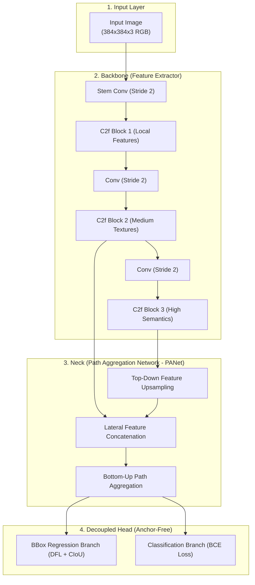

# Chapter 6: AI/ML Engineering & Model Optimization

Agesis EYE uses a customized single-stage convolutional detector optimized for lightweight edge execution.

This chapter details the neural network architecture, dataset engineering, loss formulations, and export pipelines used in creating **`agesis06.onnx`**.

---

## 1. Object Detection Architecture: YOLO Edge Variant

Single-stage detectors simultaneously predict bounding box coordinates and class probabilities across a unified feature grid, avoiding the multi-pass bottlenecks of R-CNN architectures.



### Architectural Highlights
* **Stem Layer**: Rapidly downsamples high-resolution inputs to reduce memory bandwidth consumption.
* **C2f Modules**: Split-and-cross feature connections enhance gradient flow while cutting redundant parameter counts.
* **Decoupled Anchor-Free Head**: Separating classification from bounding box regression accelerates convergence and eliminates manual anchor box hyperparameter tuning.

---

## 2. Dataset Engineering & Synthetic Augmentation

Real-world tracking models must remain resilient against varied lighting, motion blur, and backgrounds:

```
+-----------------------------------------------------------+
|              DATASET AUGMENTATION PIPELINE                |
|                                                           |
| [Raw Dataset] ──> Mosaic 4-Image Stitches                 |
|               ──> Random Affine (Rotation ±15°, Scale)    |
|               ──> HSV Chromatic Shift (Hue ±0.015)        |
|               ──> Synthetic Motion Blur (Kernel 3x3..7x7) |
|               ──> MixUp Alpha Blending                    |
+-----------------------------------------------------------+
```

1. **Mosaic Augmentation**: Stitches 4 randomly cropped images into one, forcing the network to detect targets at varying spatial scales and preventing border biases.
2. **Synthetic Motion Blur**: Simulates fast turret panning by applying randomized linear directional blur filters.
3. **Chromatic Jitter**: Randomizes HSV channels to prevent the model from memorizing specific balloon dye shades.

---

## 3. Multi-Task Loss Formulation

Training optimizes a composite loss function balancing localization accuracy and classification confidence:

$$\mathcal{L}_{\text{total}} = \lambda_{\text{box}} \mathcal{L}_{\text{CIoU}} + \lambda_{\text{cls}} \mathcal{L}_{\text{BCE}} + \lambda_{\text{dfl}} \mathcal{L}_{\text{DFL}}$$

### 1. Complete Intersection over Union ($\mathcal{L}_{\text{CIoU}}$)
Accounts for overlap area, central point distance, and aspect ratio:
$$\mathcal{L}_{\text{CIoU}} = 1 - \text{IoU} + \frac{\rho^2(b, b^{gt})}{c^2} + \alpha v$$
where:
* $\rho(b, b^{gt})$ is the Euclidean distance between predicted and ground-truth centroids.
* $c$ is the diagonal length of the smallest enclosing box.
* $v = \frac{4}{\pi^2}\left(\arctan\frac{w^{gt}}{h^{gt}} - \arctan\frac{w}{h}\right)^2$ penalizes aspect ratio discrepancies.

### 2. Distribution Focal Loss ($\mathcal{L}_{\text{DFL}}$)
Formulates bounding box regression as a continuous probability distribution rather than a deterministic single float, improving localization under occlusions.

---

## 4. PyTorch to ONNX Export & Optimization Pipeline

Deploying native `.pt` models carries high interpreter overhead. Converting to ONNX freezes the computational graph for high-speed SIMD evaluation:

```python
from ultralytics import YOLO

# 1. Load trained PyTorch checkpoint
model = YOLO("agesis06.pt")

# 2. Export to optimized static ONNX graph
model.export(
    format="onnx",
    imgsz=384,          # Optimal resolution for QVGA 320x240 camera feeds
    dynamic=False,      # Fixed tensor shape maximizes memory layout speed
    simplify=True,      # Run ONNX-Simplifier to fold constants
    opset=12            # Broad compatibility across all CPU runtimes
)
```

### Performance Comparison

| Metric | Native PyTorch (`.pt`) | ONNX Runtime (`.onnx`) | Improvement |
| :--- | :--- | :--- | :--- |
| **Inference Time (CPU)**| $32.4\text{ ms}$ | **$14.2\text{ ms}$** | **2.28x Faster** |
| **Frame Rate (FPS)** | $\approx 30.8\text{ FPS}$ | **$\ge 70.4\text{ FPS}$** | **128% Higher Throughput** |
| **RAM Consumption** | $850\text{ MB}$ | **$210\text{ MB}$** | **75% Memory Reduction** |
| **Dependencies** | PyTorch, TorchVision, CUDA | Pure `onnxruntime` | **Zero GPU/CUDA Bloat** |
