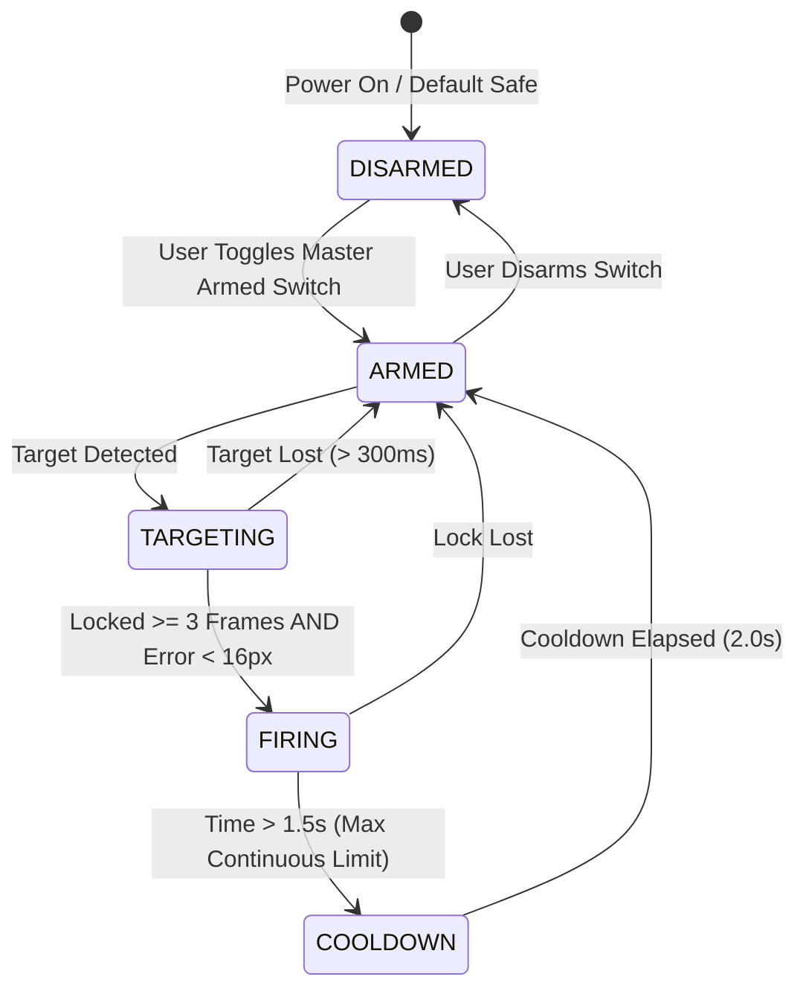

# Chapter 7: Hardware Assembly, Wiring & Safety Protocols

This chapter provides a step-by-step engineering guide for physically building, wiring, and safely operating the Agesis EYE turret based on the Tinkercad CAD mechanical assembly.

---

## 1. Bill of Materials (BOM)

| Component | Quantity | Specification / Notes |
| :--- | :--- | :--- |
| **ESP32-CAM Board** | 1 | AI-Thinker model with OV2640 camera module |
| **FTDI Programmer** | 1 | USB-to-UART adapter (3.3V logic) for initial firmware flash |
| **Micro-Servos** | 2 | TowerPro SG90 (9g micro-servo, 180° or 360° continuous) |
| **Laser Diode Module** | 1 | 5V / 650nm Red Laser Diode ($5\text{mW}$ Class 3R) |
| **Power Supply** | 1 | 5V 2A DC regulated wall adapter |
| **Decoupling Capacitor** | 1 | $470\,\mu\text{F}$ to $1000\,\mu\text{F}$ Electrolytic (10V+) |
| **3D Printed / CAD Parts**| 1 Set | Red Baseplate, Peach Enclosure, Orange Pedestal, Riser, Red C-Arm |
| **Hardware Fasteners** | 8 | M2 x 8mm machine screws for servo horns and brackets |

---

## 2. Step-by-Step Mechanical Assembly

Follow the construction order matching the Tinkercad CAD design:

```
[Step 5: Red C-Arm & Emitter]
           │
[Step 4: Tilt SG90 on Riser Spar]
           │
[Step 3: Standoff Spar d]
           │
[Step 2: Pan SG90 on Pedestal]
           │
[Step 1: Orange Pedestal & Red Baseplate]
```

### Step 1: Baseplate & Electronics Enclosure
1. Place the **Red Rectangular Baseplate** flat on your work surface.
2. Fasten the **Peach Electronics Enclosure** onto the right-hand portion of the baseplate.
3. Seat the ESP32-CAM inside the enclosure, ensuring the micro-USB / DC power port faces outward for easy connection.

### Step 2: Pedestal Column & Pan Servo
1. Mount the **Orange Cylindrical Pedestal** vertically onto the left-hand circular mounting recess of the red baseplate.
2. Insert **Servo 1 (Pan)** vertically into the top pocket of the orange pedestal with its splined output shaft pointing straight upwards.
3. Fasten the servo mounting ears using two M2 screws.

### Step 3: Riser Standoff Spar (Dimension $d$)
1. Press the standard single-arm or circular servo horn into the bottom pocket of the **Vertical Riser Spar**.
2. Mount the spar horn onto Servo 1's vertical shaft.
3. *Note*: The height of this spar defines distance $d$. Thanks to the $d$-invariant kinematics, any length from $15\text{ mm}$ to $150\text{ mm}$ will function seamlessly without software recalibration.

### Step 4: Tilt Servo Installation
1. Mount **Servo 2 (Tilt)** horizontally into the side bracket at the top of the riser spar.
2. Fasten the servo body using M2 screws, ensuring its output shaft points sideways.

### Step 5: Red C-Arm & Sensor Cradle
1. Fasten the **Red C-Shaped Cantilever Arm** onto Servo 2's horn.
2. Secure the OV2640 camera lens in the upper cradle opening of the C-arm, facing forward along the boresight.
3. Seat the laser diode emitter in the lower cradle opening, collinear with the camera optical axis.

---

## 3. Electrical Wiring Diagram

```
                             5V 2A DC Power Adapter
                              +           -
                              |           |
                              +-----+-----+
                                    |
          +-------------------------+-------------------------+
          |                         |                         |
          v                         v                         v
     [ESP32-CAM]              [Pan Servo]               [Tilt Servo]
   +-------------+          +-------------+           +-------------+
   | 5V   <------+-- 5V     | Red   <-----+-- 5V      | Red   <-----+-- 5V
   | GND  <------+-- GND    | Brown <-----+-- GND     | Brown <-----+-- GND
   |             |          | Orange (PWM)|           | Orange (PWM)|
   | IO12 (PWM) -+--------> |             |           |             |
   | IO13 (PWM) -+----------------------------------> |             |
   | IO14 (OUT) -+----+     +-------------+           +-------------+
   +-------------+    |
                      v
                [Laser Diode]
               +-------------+
               | Red (+) <---+ (IO14 Trigger)
               | Blue (-) <--+ (Common GND)
               +-------------+
```

### Wiring Table

| Component Wire | Connection Point | Function |
| :--- | :--- | :--- |
| **ESP32 5V** | Adapter 5V (+) Rail | Microcontroller main power input |
| **ESP32 GND** | Adapter GND (-) Rail | Common ground reference |
| **Pan Servo (Red)** | Adapter 5V (+) Rail | Motor power |
| **Pan Servo (Brown)**| Adapter GND (-) Rail | Motor ground |
| **Pan Servo (Orange)**| **ESP32 GPIO 12** | LEDC Channel 2 hardware PWM |
| **Tilt Servo (Red)** | Adapter 5V (+) Rail | Motor power |
| **Tilt Servo (Brown)**| Adapter GND (-) Rail | Motor ground |
| **Tilt Servo (Orange)**| **ESP32 GPIO 13**| LEDC Channel 3 hardware PWM |
| **Laser Diode (Red)**| **ESP32 GPIO 14** | Optical targeting trigger signal |
| **Laser Diode (Blue)**| Adapter GND (-) Rail | Laser cathode ground return |

> [!IMPORTANT]
> **Decoupling Capacitor Recommendation**: Solder a **$470\,\mu\text{F}$ or $1000\,\mu\text{F}$ electrolytic capacitor** directly across the 5V and GND rails near the servo leads. This absorbs transient inrush currents when the motors kick on, ensuring the 5V rail remains smooth and preventing Wi-Fi brownouts.

---

## 4. Laser Safety Protocols & Interlock State Machine

High-energy laser emitters present potential optical radiation hazards. Agesis EYE implements strict multi-tier safety interlocks:



### Safety Rules Implemented in Software
1. **Physical Master Arm**: The laser is software-locked in the `DISARMED` state on boot. It will not energize until explicitly armed by the operator.
2. **Persistence Lock Requirement**: Firing requires $\ge 3$ consecutive frames of positive target confirmation. Transient glints will never trigger a pulse.
3. **Centering Threshold**: The target centroid must be within a $\pm 16\text{ px}$ optical error cone of the central boresight.
4. **Instant Cutoff**: If optical tracking is broken for more than $300\text{ ms}$, the laser output immediately drops to $0\text{ V}$.
5. **Thermal Duty Cycle**: Continuous firing is hardware-capped at **$1.5\text{ seconds}$**, followed by an enforced **$2.0\text{-second}$ cooldown lockout**.

> [!WARNING]
> **Protective Eyewear**: Always wear certified laser safety glasses rated for the wavelength of your emitter (e.g. $650\text{nm}$ OD $4+$) when operating the turret with an active laser diode. Never look directly into the beam path.
