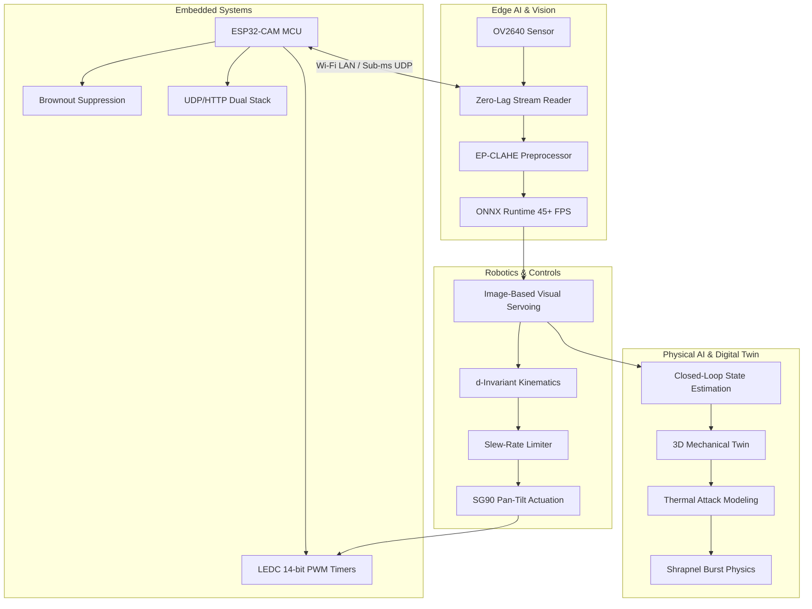

# Agesis EYE: Complete Technical Reference & Curriculum

Welcome to the comprehensive technical documentation and engineering curriculum for **Agesis EYE**—an autonomous vision, tactical tracking, and closed-loop pan-tilt targeting station.

This documentation suite covers every layer of the system: from silicon registers and microsecond PWM pulse trains on the ESP32, to low-latency UDP network sockets, high-throughput ONNX computer vision pipelines, robotic visual servoing kinematics, and modern 3D physics digital twins.

---

## 📚 Curriculum Structure

The documentation is organized into 7 specialized chapters:

1. [**System Architecture & End-to-End Integration**](file:///c:/Users/ASUS/Desktop/Agesis%20EYE/docs/01_system_architecture.md)
   - Architectural topology and subsystem breakdown
   - End-to-end telemetry and command lifecycle
   - Latency budget breakdown across all communication boundaries

2. [**Embedded Systems & Firmware Engineering**](file:///c:/Users/ASUS/Desktop/Agesis%20EYE/docs/02_embedded_systems_firmware.md)
   - ESP32-CAM (AI-Thinker) architecture and GPIO allocation
   - LEDC 14-bit timer PWM generation for SG90 micro-servos
   - 5V 2A power rail budget and transient inrush suppression
   - Brownout register manipulation (`RTC_CNTL_BROWN_OUT_REG`)
   - FreeRTOS cooperative scheduling and multi-protocol listeners (UDP 8888 + HTTP 81 + UART)

3. [**Edge AI & Real-Time Computer Vision Pipeline**](file:///c:/Users/ASUS/Desktop/Agesis%20EYE/docs/03_edge_ai_and_vision_pipeline.md)
   - Decoupled Zero-Lag streaming reader vs. standard buffer stalls
   - ONNX Runtime execution provider optimization (45+ FPS CPU)
   - Edge contrast enhancement with domain-specific EP-CLAHE
   - Bounding box extraction, confidence thresholding, and center-offset normalization

4. [**Robotics, Kinematics & Visual Servoing**](file:///c:/Users/ASUS/Desktop/Agesis%20EYE/docs/04_robotics_and_kinematics.md)
   - 2-DoF Pan-Tilt spherical coordinate transformations
   - Mathematical proof of inter-servo distance $d$ invariance
   - Image-Based Visual Servoing (IBVS) error dynamics
   - S-curve trajectory profiling and slew-rate acceleration limiting

5. [**Physical AI & 3D Kinematic Digital Twin**](file:///c:/Users/ASUS/Desktop/Agesis%20EYE/docs/05_physical_ai_and_digital_twin.md)
   - Bridging perception models to physical mechanical action
   - Browser-based 3D projection engine (trigonometric rotation matrix)
   - Tinkercad CAD mechanical assembly matching (base, pedestal, servos, C-arm)
   - Real-time thermal load accumulation, shrapnel explosion physics, and respawn cycle

6. [**AI/ML Engineering & Model Optimization**](file:///c:/Users/ASUS/Desktop/Agesis%20EYE/docs/06_ai_ml_engineering.md)
   - YOLO architecture adaptation for aerial balloon and target tracking
   - Dataset curation, augmentation techniques, and synthetic data injection
   - Quantization, pruning, and PyTorch $\to$ ONNX conversion pipeline
   - Evaluation metrics: IoU, mAP@0.5, inference throughput vs. precision trade-offs

7. [**Hardware Assembly, Wiring & Safety Protocols**](file:///c:/Users/ASUS/Desktop/Agesis%20EYE/docs/07_hardware_assembly_and_wiring.md)
   - Step-by-step physical build guide based on Tinkercad CAD models
   - Complete schematic diagram and Bill of Materials (BOM)
   - Laser safety interlock state machine and optical radiation hazards

---

## 🎯 Technology Domain Coverage

| Domain | How It Is Addressed in Agesis EYE |
| :--- | :--- |
| **Embedded Systems** | Bare-metal register manipulation, ESP32 memory mapping, PSRAM double-buffering, PWM timer tick calculations, and power surge mitigation. |
| **Edge AI** | Deploying quantized neural networks to local CPU/edge runtimes, achieving sub-15ms inference latency without cloud dependencies. |
| **Robotics** | Forward/inverse kinematics, 2-DoF actuation, proportional-integral-derivative servoing, and geometric parallax compensation. |
| **Physical AI** | Autonomous closed-loop feedback systems where sensory inputs immediately translate into physical mechanical actuation and safety boundaries. |
| **AI / ML** | Deep convolutional neural network training, post-training optimization, anchor tuning, non-maximum suppression, and real-time inferencing. |
